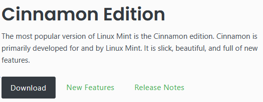
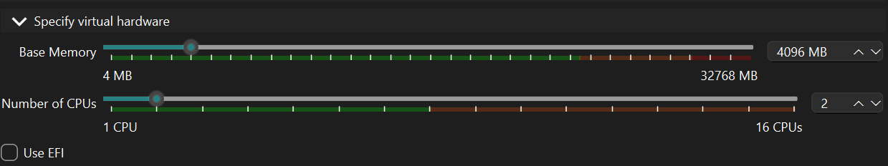
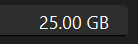
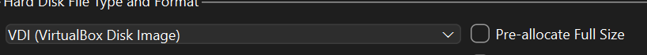
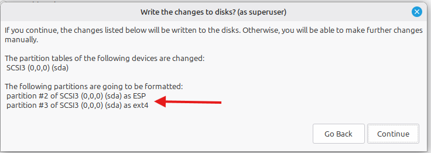
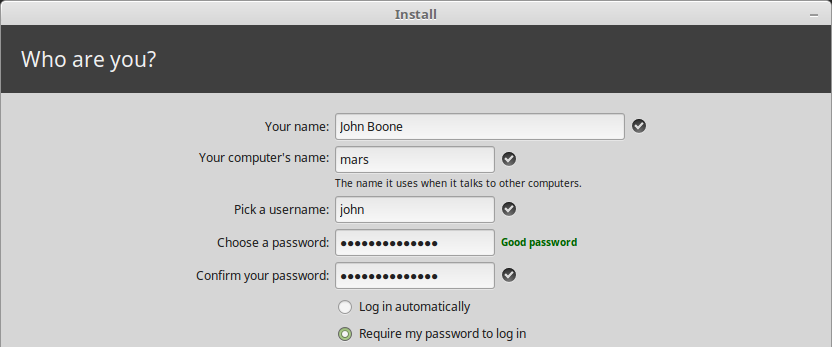
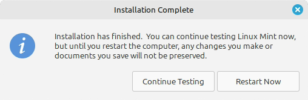

---
hub:
  kind: resource
template: article.html
---
# VirtualBox: Installing Linux Mint

Install Linux Mint Cinnamon inside a virtual machine, then verify that it starts from its own virtual disk. The finished **Minty Fresh** VM provides a Linux desktop and terminal for hands-on practice. This shared lab supports A+ Core 1 virtualization and A+ Core 2 operating system installation.

## Before you begin

Use a Windows 10 or Windows 11 computer with an Intel or AMD 64-bit processor, permission to install software, and hardware virtualization enabled. In Windows **Task Manager → Performance → CPU**, check **Virtualization: Enabled**. If it is disabled, use your computer manufacturer's instructions to enable Intel VT-x or AMD-V in firmware. The Cinnamon ISO used here is for x86-64 computers; it cannot run as a VirtualBox guest on an Arm host.

The host needs enough available memory to give the VM 4 GB while continuing to run Windows. An 8 GB host can be tight with other applications open; 16 GB gives more room. Have at least 35 GB of free host storage for the 25 GB virtual disk, ISO, and setup files. Snapshots and additional software need more space. Close other resource-heavy applications before starting the VM.

| Setting | Configuration |
| --- | --- |
| VM name | Minty Fresh |
| Guest operating system | Linux Mint Cinnamon, 64-bit |
| RAM | 4096 MB |
| Virtual CPUs | 2 |
| Virtual disk | New 25 GB VDI, dynamically allocated |
| Installation | Standard manual installation |
| Network | Default NAT connection |

The 25 GB disk is intended for this installation and basic terminal practice. A long-term Linux desktop with many applications or snapshots needs more space.

## How the virtual machine works

| Term | Meaning in this lab |
| --- | --- |
| Host operating system | Windows runs on the physical computer and provides the environment for VirtualBox. |
| Guest operating system | Linux Mint runs inside the VM and sees virtual hardware. |
| Hypervisor | Software that creates and runs VMs. VirtualBox is a hosted, or Type 2, hypervisor because it runs on an existing operating system. A Type 1 hypervisor runs directly on hardware. |
| ISO image | A file containing installation media. VirtualBox presents the Mint ISO as a disc in the VM's virtual optical drive. |
| Virtual disk | The VDI file stored on the host. Mint sees it as a hard drive and stores its installed system and files inside it. |
| Partition | A defined region of a disk. The installer creates partitions within the new virtual disk. |
| File system | The structure used to organize files within a partition. The main Mint system partition uses ext4. |

The guest uses real host CPU time, RAM, and storage. Creating virtual hardware does not add physical resources to the computer.

Screenshots focus on the relevant controls. Select an image to view it at full size.

## 1. Install Oracle VirtualBox

1. Open the [official VirtualBox download page](https://www.virtualbox.org/wiki/Downloads).
2. Under **VirtualBox platform packages**, select **Windows hosts** for your Intel or AMD Windows computer.
3. Run the downloaded Windows installer. Its filename includes a version and build number, such as `VirtualBox-<version>-<build>-Win.exe`; use the current package rather than searching for one specific filename.
4. Keep the default installation location and main components. If the installer reports missing dependencies for **Python Support**, you can deselect that optional component; this lab uses the graphical interface.
5. Approve the Windows administrator prompt and Oracle driver installation prompts. The networking component may briefly interrupt the host network connection, so finish calls or downloads first.
6. Complete the installation and open **Oracle VirtualBox Manager**. The separate Extension Pack is not required for this lab.

[](images/virtualbox-download.png)

*Figure 1. Choose the package for the host operating system.*

**Checkpoint:** VirtualBox Manager opens on Windows.

## 2. Download Linux Mint Cinnamon

1. Open the [official Linux Mint download page](https://linuxmint.com/download.php).
2. Select **Download** under **Cinnamon Edition**, then select a download mirror from Mint's edition page.
3. Save the 64-bit ISO on the host. For Linux Mint 22.3, the filename is `linuxmint-22.3-cinnamon-64bit.iso`; another release will have a different version in its filename.
4. Follow Mint's [ISO verification guide](https://linuxmint-installation-guide.readthedocs.io/en/latest/verify.html) to check the download's integrity and authenticity before using it.

[](images/mint-download.png)

*Figure 2. Download the Cinnamon edition.*

The ISO is virtual installation media. Keep it as an `.iso` file; it does not need to be extracted or written to a USB drive for this lab. You can begin creating the VM while it downloads, then attach it before starting the VM.

**Checkpoint:** The Cinnamon ISO has finished downloading and you know where it is saved.

## 3. Create Minty Fresh

1. In VirtualBox Manager, set **File → Preferences → Experience Level** to **Expert** if you want the expandable sections shown below. Basic mode presents similar settings across several screens.
2. Select **New**.
3. Enter **Minty Fresh** for **VM Name**. Keep the default **VM Folder**, or choose another host folder with enough free storage.
4. Under **ISO Image**, select **Other** or the file chooser and browse to your downloaded Mint ISO. If it is still downloading, leave the ISO empty and attach it in Step 6.
5. Confirm **OS/Type: Linux**, **OS Distribution: Ubuntu**, and a **64-bit Ubuntu** version. Mint's main edition is Ubuntu-based, so an Ubuntu profile is expected. The profile chooses virtual hardware defaults; the selected ISO determines the operating system that will actually be installed. Leave **OS Edition** empty if it is not applicable.
6. Disable automatic installation: clear **Proceed with Unattended Installation** or **Install OS Using Unattended Installation**. In versions showing **Skip Unattended Installation**, select that checkbox instead.

[](images/virtualbox-new.png)

*Figure 3. Select New to create a VM configuration.*

[](images/manual-install.png)

*Figure 4. Leave unattended installation disabled so you can complete the Mint installer yourself. Labels vary across VirtualBox versions.*

## 4. Configure virtual hardware

1. Expand **Specify virtual hardware** or continue to the hardware screen.
2. Set **Base Memory** to **4096 MB**.
3. Set **Number of CPUs/Processors** to **2**.
4. Keep the other hardware settings at their defaults. Use the same firmware setting throughout installation and subsequent boots.

[](images/virtual-hardware.png)

*Figure 5. Assign 4096 MB RAM and two virtual CPUs. The slider limits reflect the host used for this capture.*

The RAM allocation is unavailable to Windows while the VM runs. The two virtual CPUs share the host processor's computing time.

## 5. Create the virtual disk

1. Expand **Specify virtual hard disk** or continue to the disk screen.
2. Select **Create a New Virtual Hard Disk**. This lab uses a new empty disk, rather than an existing VM's disk.
3. Set **Disk Size** to **25.00 GB**.
4. Select **VDI (VirtualBox Disk Image)**.
5. Leave **Pre-allocate Full Size** unchecked. If a separate allocation screen appears, choose **Dynamically allocated**.
6. Select **Finish** to create the VM.

[](images/disk-size.png)

*Figure 6. Set the virtual disk's maximum capacity to 25 GB.*

[](images/disk-format.png)

*Figure 7. Use VDI with dynamic allocation.*

A dynamically allocated VDI starts small and grows as the guest writes data, up to its configured capacity. It does not reserve all 25 GB immediately, and deleting files inside Mint does not automatically shrink the VDI on the host. Windows still needs enough free space for the disk to grow.

## 6. Attach the ISO and check the VM

1. Select **Minty Fresh** in VirtualBox Manager. Keep the VM powered off while changing these settings.
2. Open **Settings → Storage**. Confirm that the attached hard disk is the new **Minty Fresh.vdi**, with a capacity of 25 GB. It is usually connected to a SATA controller.
3. Select the virtual optical drive beneath its controller. If it shows **Empty**, select the disc icon, choose **Choose a disk file**, and select the Mint ISO. If the ISO is already attached, confirm its filename. If no optical drive exists, use **Add Optical Drive** on the storage controller first.
4. Confirm that this VM has only its newly created VDI as a hard disk. Leave physical host disks and unrelated virtual disks unattached.
5. Under **System**, confirm **4096 MB** RAM and **2** processors. Keep the default **NAT** network adapter enabled for Internet access.
6. Save the settings, then select **Start**.

**Checkpoint:** The VM starts from the Cinnamon ISO. If it reports no bootable medium, power it off and check the optical drive attachment. If it reports a virtualization error, check the host's virtualization status and the error message before changing Windows features.

## 7. Start the standard Mint installation

1. If a boot menu appears, choose **Start Linux Mint**, the normal Cinnamon startup entry. Use standard startup rather than **OEM install**, which prepares a system for someone else to configure later.
2. Wait for the live desktop, then double-click **Install Linux Mint**.
3. Select your language and keyboard layout. Use the keyboard test field to confirm that the selected layout matches your keyboard.
4. If connected to the Internet, select **Install multimedia codecs** for common media support. You can install them later if the VM is offline.
5. Continue to **Installation type**.

The live session runs from the ISO and is used to install or try Mint. Reaching this desktop alone does not mean Mint has been installed on the VDI. The live session normally uses the account `mint`; your own account is created during installation.

## 8. Install on the new virtual disk

**Disk safety:** Complete this step inside the **Minty Fresh VirtualBox window**, with only the new 25 GB VDI attached. **Erase disk** applies to the disk presented to this VM. With this configuration, that is the VDI, rather than the Windows system drive. A VM configured with physical-disk access or another attached disk needs a separate review before erasing anything.

1. Select **Erase disk and install Linux Mint**. Keep advanced storage options at their defaults. The installer will create the partitions automatically; **Something else** is for manually arranging partitions and is not needed here. Manual installation means completing the installer yourself, rather than manually partitioning the disk.
2. Select **Install Now**.
3. Review the disk-change confirmation. A disk named **sda** or **/dev/sda** is typical for this VM. Confirm that it is the new empty virtual disk; where capacity is shown, 25 GB may appear as roughly **26.8 GB** because the installer and VirtualBox can use different units. If additional disks or an existing operating system appear, cancel and recheck **Settings → Storage**.
4. Confirm that the main Linux partition will use **ext4**, then select **Continue**.

[](images/partition-confirmation.png)

*Figure 8. Example disk-change confirmation. Partition numbers and small boot partitions can vary with firmware and installer versions; confirm the VM's disk before continuing.*

The partition table describes how the virtual disk is divided. Formatting the main partition with ext4 creates the structure Mint will use to store its operating system and files. The root directory `/` is the top of the installed Linux file hierarchy.

## 9. Configure your account

Choose your local time zone. On **Who are you?**, enter a display name, computer name, and username. For example:

| Field | Example |
| --- | --- |
| Your name | Student |
| Computer name / hostname | minty-fresh |
| Username | student |
| Password | A unique password or passphrase you choose |

1. Use lowercase letters for the username. The computer name identifies the guest on a network; it does not need to match the VirtualBox VM name.
2. Enter and confirm your password. Select **Require my password to log in**. Keep additional encryption options at their defaults for this basic installation.
3. Select **Continue** and wait while Mint copies files and completes setup.

[](images/user-account.png)

*Figure 9. Standard account setup from Linux Mint's official installation guide. Use your own values; the guide's sample account is shown here. Appearance can differ by release.*

This is your normal login account, rather than a temporary OEM account. The password is also used when approving administrative tasks. When entering a password in a Linux terminal, no characters or dots normally appear; type it and press **Enter**.

## 10. Restart from the installed system

1. When installation finishes, select **Restart Now**.
2. When Mint asks you to remove installation media, open the VM window's **Devices → Optical Drives → Remove disk from virtual drive**. Confirm a force-unmount prompt if one appears at this removal step, then press **Enter** in the VM.
3. If the VM boots back into the live desktop, shut it down. In VirtualBox Manager, open **Settings → Storage**, select the virtual optical drive, and remove the ISO. Keep **Minty Fresh.vdi** attached, then start the VM again.
4. Sign in with the username and password you created. The Cinnamon desktop should load from the VDI.

[](images/installation-complete.png)

*Figure 10. Restart Now completes the installation sequence. Official Linux Mint installer example.*

**Checkpoint:** The optical drive is empty and Mint still starts. This confirms that the VM can boot from its installed virtual disk without the ISO.

## 11. Open the terminal and verify installation

Inside the Mint desktop, press **Ctrl+Alt+T**, or open **Menu**, search for **Terminal**, and launch it. Run the following commands one at a time:

```bash
whoami
hostname
cat /etc/os-release
findmnt /
```

| Command | What to check |
| --- | --- |
| `whoami` | Your installed username, such as `student`, rather than the live session's `mint` account. |
| `hostname` | The guest computer name you chose, such as `minty-fresh`. |
| `cat /etc/os-release` | Identifies Linux Mint and its installed version. |
| `findmnt /` | Shows `/` mounted from a disk partition, typically `/dev/sda…`, using ext4. A live session commonly shows an overlay filesystem instead. |

1. Close the terminal, use **Menu → Quit → Shut Down**, then start **Minty Fresh** again in VirtualBox. Confirm that your account and desktop remain available with the ISO detached.
2. Reopen the terminal. The VM is now ready for basic Linux command-line practice.

To release a captured keyboard or mouse back to Windows, press the **Host key** shown in the VM window's status bar. On a Windows host, the default is **Right Ctrl**.

## Final installation check

- VirtualBox shows **Minty Fresh**, **4096 MB RAM**, **2 CPUs**, and the new **25 GB VDI**.
- The Mint ISO is removed from the virtual optical drive.
- Mint boots to the installed account and Cinnamon desktop after a shutdown and start.
- The terminal identifies Linux Mint, your username, and an ext4 root filesystem on the virtual disk.

[Back to IT Support Labs](../README.md) · [All Labs](../../README.md) · [A+ Core 1](../../../certifications/comptia/a-plus-core-1/README.md) · [A+ Core 2](../../../certifications/comptia/a-plus-core-2/README.md)
